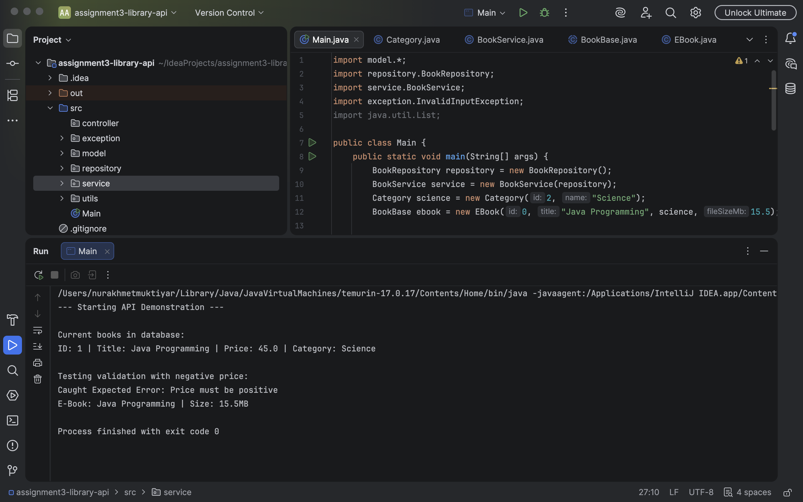

Хорошо, вот строгий вариант README.md без смайлов, оформленный профессионально и по существу.

Скопируй этот текст в свой файл:

Library Management API
Project Overview
This project is a Java-based application for library management, integrated with a PostgreSQL relational database. It is built using a layered architecture to demonstrate clean code practices and core Object-Oriented Programming (OOP) principles.

Technical Stack
Language: Java 17 (Temurin JDK).

Database: PostgreSQL 16 (Port: 5433).

Connectivity: JDBC (PostgreSQL Driver 42.7.8).

IDE: IntelliJ IDEA.

System Architecture
The application is divided into distinct layers to separate concerns:

Model Layer: Contains entity classes such as BookBase, EBook, and Category.

Repository Layer: Manages direct database interactions and SQL execution.

Service Layer: Implements business logic and performs data validation.

Controller (Main): Serves as the entry point to demonstrate API features and exception handling.

OOP Principles
Abstraction: Implemented through the BookBase abstract class to define fundamental book attributes.

Inheritance: The EBook class extends BookBase to include specific properties like file size.

Composition: Objects of the BookBase type contain a Category object, establishing a structural relationship between entities.

Polymorphism: The displayInfo() method is overridden in subclasses to provide specific output formats.

Exception Handling
The project utilizes a custom exception hierarchy to ensure system stability:

InvalidInputException: Validates business rules, such as ensuring prices remain positive.

DatabaseOperationException: Captures and manages errors during SQL execution or connection attempts.

Setup and Execution
Verify that PostgreSQL is active on port 5433 and the library_db database exists.

Ensure the postgresql-42.7.8.jar driver is added to the project libraries.

Update the credentials in DatabaseConnection.java to match the local environment.

Execute the Main.java file to start the demonstration.

Conclusion
This project demonstrates the ability to integrate Java with a relational database, implement a scalable architecture, and manage complex environment configurations such as custom database ports and JDBC connectivity.
## Execution Result
